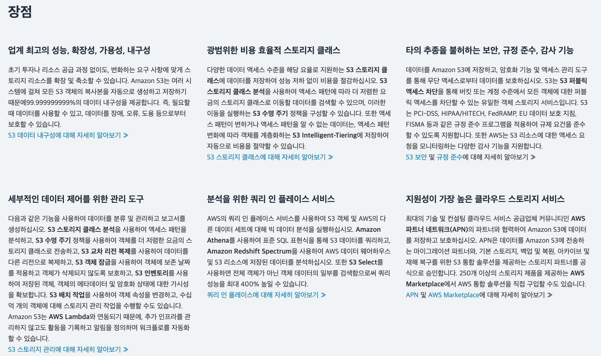
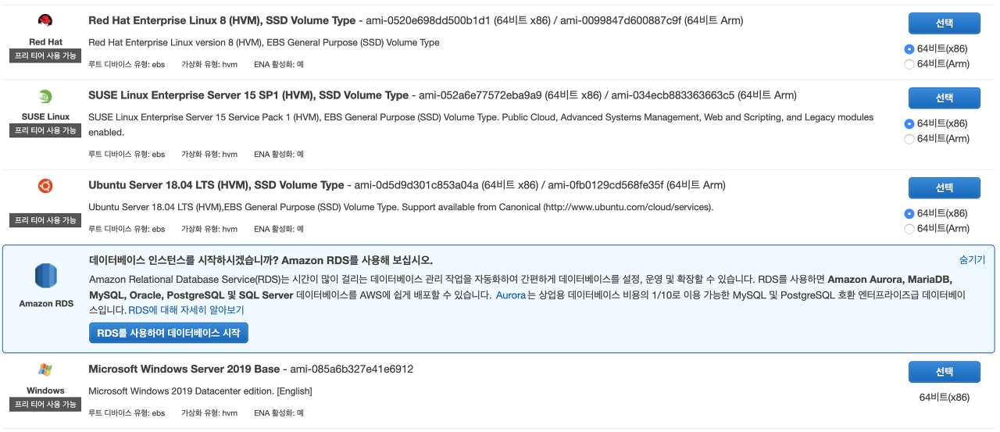
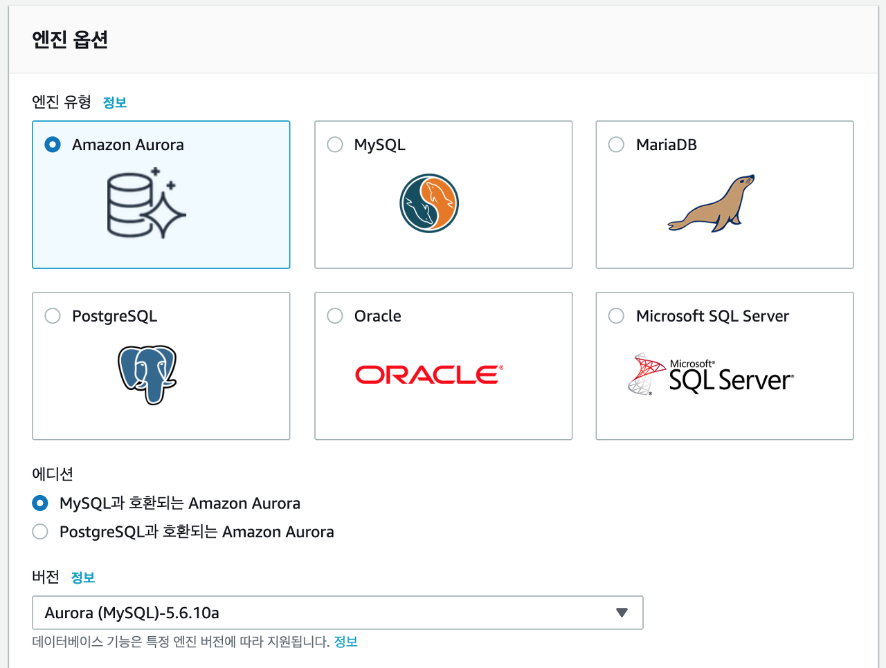

_\*굉장히 주관적인 이해를 바탕으로 작성한 글입니다._

---

AWS(Amazon Web Service)에 대한 굉장히 기초적인 공부를 했습니다.

위키백과에 의하면 "클라우드 컴퓨팅 사업부"로 설명되어 있는데, AWS홈페이지의 번역 상태부터 기본적인 용어들까지 무엇 하나 초심자에게 친절한 부분이 없습니다. 우여곡절 끝에 나름대로 이해한 AWS를 초심자의 시야에서 한마디로 표현하자면 다음과 같습니다.

**_"개발자를 위한 컴퓨터 렌탈 서비스"_**

웹개발을 공부하는 입장에서 생각해 보았을 때, **서비스를 개발 및 배포를 하기 위해서는 개발자의 컴퓨터 한 대만으로는 부족할 수 있습니다.** 정보가 많아질 수록 이 정보들을 담을 데이터베이스가 필요하고, 서비스에 대한 많은 접속이 이루어 질수록 그것을 감당할 서버가 필요하기 때문이죠. 때문에 과거에는 서버 및 데이터베이스로 활용할 용도로 컴퓨터를 추가로 구비했고, 이러한 컴퓨터들을 서버실에 한데 모아 관리를 해왔습니다. 하지만 이러한 관리 방법은 유지보수의 비용도 지속적으로 발생하고, 또한 화재, 침수 등 물리적인 손상에서 자유롭지 않습니다. **AWS는 자신들의 컴퓨터를 네이버 클라우드, 구글 드라이브같은 클라우드 형식으로 기업에게 제공함**으로써 이러한 문제점을 해결해 주었습니다.

---

S3와 EC2, RDS는 AWS를 이용한 웹서비스 배포를 위해 공부한 3가지 개념입니다. 굳이 역할을 나누자면 S3는 클라이언트 배포, EC2는 서버, RDS는 데이터베이스의 역할을 한다고 이해했는데요, 개인 컴퓨터로만 클라이언트, 서버를 돌려본 입장에서 배포 이후의 환경에 대해 이해를 하기 위해 다시금 생활코딩의 클라이언트, 서버에 대한 설명을 찾아봤습니다.

위의 사진을 통해 보자면, 기본적으로 클라이언트는 브라우저의 주소창에 어떠한 도메인을 입력하여 "index.html" 파일을 서버에 요청하고, 서버는 "index.html"에 담긴 코드를 담아 클라이언트에게 응답하면서 브라우저에 원하는 페이지가 로딩이 됩니다. 추가적으로 저장해야 할 정보가 많을 경우 데이터베이스를 구축하여 그 안에서 정보를 효율적으로 관리할 수 있어요.

이 기본적인 역할분담에 대한 이해를 바탕으로 각 개념을 돌아보려 합니다.

---

## S3(Amazon Simple Storage Service)

직역하자면 '_아마존의 간단한 저장 서비스_'입니다. 이름 그대로 단순한 파일이나 그림을 저장하는 용도로 사용할 수도 있습니다. (하지만 굳이..) 리액트를 통해 웹 클라이언트를 만들어본 입장이라면, S3를 통해 우리가 구현한 클라이언트를 저장하고, 이를 배포할 수 있습니다. 그러나 리액트를 통해 클라이언트를 완성하게 되면 사용자 입장에서는 불필요할 정도의 복잡한 파일(폴더)구조를 가지게 됩니다. 따라서 효율적인 배포를 위해 npm run build를 통해 배포하기 좋은 모양으로 만들어 줍니다. (사실 왜 이렇게 하는지에 대한 명확한 이해는 아직 부족합니다. 도움주실 분이 있다면 레퍼런스 남겨주세요) 이렇게 만들어 주면, 다양한 클라이언트가 우리의 웹앱을 요청할 때 S3의 "버켓"이라는 공간에 담아 전달해 주게 됩니다. S3의 장점이 궁금하시다면 AWS사이트에 친절히 나와있습니다.

사실 무슨 말인지 전부 이해하기는 어려웠으나, 첫 항목 중 _"모든 S3객체의 복사본을 자동으로 생성하고 저장하기 때문에 99.9999..%의 데이터 내구성을 제공합니다."_ 를 참고해보면, **여러 백업을 통해 데이터 손실을 방지한다**는 장점은 명확하게 다가왔습니다.

---

## EC2(Amazon Elastic Compute Cloud)

~직역해도 '유연한 계산 클라우드', 그냥 넘어가겠습니다~

EC2는 직관적으로 **컴퓨터를 한 대 빌린다**고 볼 수 있습니다.

AWS의 여러 컴퓨터중 **필요한 서버를 구동하기에 적합한 OS를 선택하여 그 것을 빌려 서버컴퓨터로 활용**하는 것입니다. 초기 상태는 비어있는 컴퓨터이므로 npm과 같은 패키지 매니저는 다시 설치해야 합니다. 이 때 AWS에서는 컴퓨터를 '인스턴스'라는 용어로 표현합니다.

---

## RDS(Amazon Relational Database Service)

직역하면 _'아마존의 관계형 데이터베이스 서비스'._ 위의 EC2의 개념과 비슷하지만 데이터베이스를 위한 서비스입니다. 자신의 컴퓨터에 데이터베이스를 설치해 본 경험이 있다면 이해하실텐데, EC2 또한 컴퓨터의 개념이므로 EC2에 데이터베이스를 설치하여 관리할 수도 있습니다.

다만 RDS를 활용하게 되면, OS 및 데이터의 설치, 관리, 업데이트 등의 서비스를 제공해 주기 때문에 최적화 등 다른 요소에 더 집중할 수 있겠죠. (물론 EC2에서 데이터베이스 관리까지 하는 것이 저렴할 지도 모릅니다.)

---

이렇게 정리해 놓고 AWS가 가져온 혁신에 대해 생각해보자면, 서비스를 배포하는 과정에 있어서 발생하는 진입장벽을 매우 낮춰 주었다는 점은 명확해 보입니다. 다만 도전하는 입장에서 다소 두려운건 까딱 잘못하면 의도치 않은 과금이 나올 수 있다는 것...계속 신경을 놓지 말아야 겠습니다. AWS를 처음 접하시는 분들에게 도움이 되었으면 좋겠습니다.
