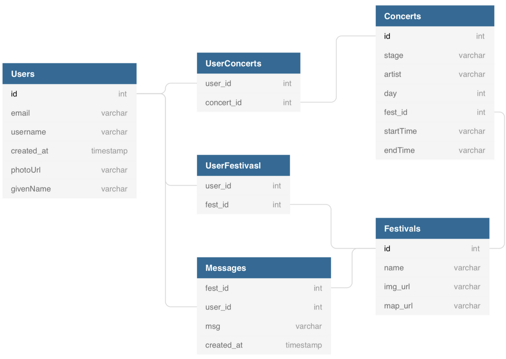
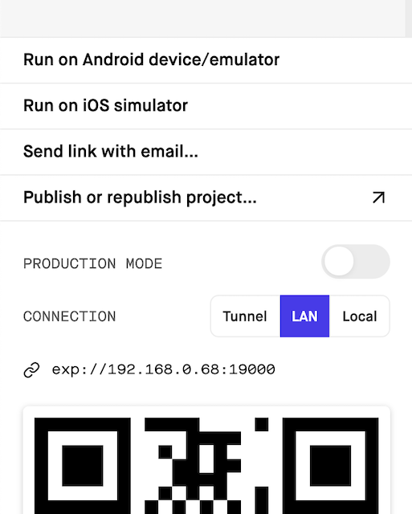

스프린트가 끝난 이후 2주 프로젝트로 Fastivsal이라는 이름의 앱을 만들기로 했다.

앱의 기본적인 기능

1\. 페스티벌중 가고 싶은 페스티벌을 골라 담아놓는다. (구글 로그인을 통해 사용자 인증)

2\. 다양한 장소, 시간대별로 진행하는 공연중 자신이 가고 싶은 공연들을 골라 내 시간표에 담는다.

3\. 같은 페스티벌을 선택한 사용자간 채팅이 가능하다. (쓰레드 형식)

4\. (Advanced) 공연장 지도를 제공하여 지도 내에서 자신이 고른 공연의 위치를 확인한다.

스택

프론트엔드 : 모바일 어플리케이션을 구현하는 것이고, 기존에 리액트를 배웠기 때문에 리액트 네이티브로 구현하기로 했다.

백엔드 : node.js(그리고 express)를 기반으로 서버배포는 AWS EC2와 RDS를 활용했다. DB는 기존에 접했던 Mysql과 유사한 MariaDB를 사용해보기로 했다.

---

백엔드를 경험해보고 싶다는 팀원이 있어서 자연스럽게 **프론트엔드를** 맡게 되었다._(또한 아이디어를 냈다는 이유로 자연스럽게 팀장까지 맡게 되었다.)_ 리액트를 알고 있다면 리액트 네이티브에 대한 러닝커브가 거의 없다고 한다. 다만 지나온 스프린트 자체가 하나의 스택을 심도있게 짚고 넘어가기엔 시간이 너무 촉박했기에 이제서야 리액트와 리액트 네이티브를 동시에 제대로 공부하는 느낌이다. 당연한 얘기일 수도 있지만, 팀원 전부가 프로젝트에 대한 경험이 전무해서 많은 시행착오를 겪었다. 다행히도 팀원들이 서로 배려해주고, 적극적으로 의사소통을 해주어 큰 스트레스 없이 기분 좋게 진행할 수 있었다.

앞으로의 성장을 위해, 프로젝트간 겪었던 시행착오들을 어쩌다 직면하고, 어떻게 극복하였는지 하나부터 열까지 남기려 한다.

---

### 기획 및 범위설정

난이도 별로 베어 미니멈(BareMinimum), 어드밴스드(Advanced), 나이트메어(Nightmare)로 기능을 기획하는 것이 프로젝트의 시작이었다. 리액트 네이티브로 활용이 용이한 API가 어느 것이 있는지 몰라서 이후에 많은 부분들을 수정해야 했다.

설정을 끝내 놓고서 확인한 가장 큰 문제는 **백엔드의 비중이 너무 적어 시간이 빌 것 같다**는 점이었다. 이를 토대로 엔지니어와의 상담 끝에 BareMinimum의 6. '공연 시간에 맞추어 푸쉬알람'은 리액트 네이티브로 구현하는 것이 쉽지 않을 것이라는 조언을 듣고 Advanced에 이동, 그리고 백엔드의 비중확보를 위해 Advanced의 1. '축제 관련 커뮤니티' 를 오픈채팅 형식으로 구현하기로 결정하며 BareMinimum으로 가져왔다. (현재 실질적으로 슬랙의 Thread형태가 되어가고 있다.)

~글을 쓰는 현재 3~4일의 시간이 남아 있는데 백엔드의 범위가 끝났고, 나아가 크롤링까지 거의 다 마치는 단계라 하루이틀 내에 리액트 네이티브를 접하게 될 것 같다.~  채팅 앱 구현을 위해 socket.io를 적용하게 되어 발표 당일까지 붙잡고 있었다. 프로젝트를 마치고 돌아보니,  계획을 더 챌린징하게 잡았으면 더 시간을 쪼개고 더 치열하게 하지 않았을까, 하는 미련도 다소 남는다.

---

### 구조 디자인 & API 명세서 작성

**진행간 엔드포인트와 API문서를 끊임없이 수정했다.** 프로젝트 진행 전에 꼭 신중하게 구조를 짜고, API를 작성해야 한다는 사실은 팀원 모두가 잘 이해하고 있었다. 그러나 구조가 정확히 어떤 식으로 연결되어 있고, 컴퍼넌트 간의 props, state는 어디서 어디로 전달해야 하는지에 대한 개념이 아직 명확하지 않았기 때문에 스키마와 API는 프로젝트가 끝날 때까지 무한한 수정을 거쳐야 했다. (NR-Gifted-Chat을 가져다 사용하는 상황에서는 데이터의 틀이 강제되어 어쩔 수 없이 수정한 경우도 있었다.) **그래도 스키마의 경우 가장 신중히 짠 덕에 데이터 이름을 제외하고는 구조 자체를 수정할 일이 없었다는 점은 뿌듯하다. **API문서, 엔드포인트, 스키마를 작성할 경우에는 더더욱 치열하게 고민해야 한다. **이정도면 됐다고 싶을 때 한번 더 고민하자. **API문서 내에 각각의 요소들이 가리키는 데이터를 세세히 명시해야 작업간 서로 혼동이 없다.

---

### GIT 협업 플로우 익히기

스프린트 기간 동안에는, fork, git remote add pair, git clone, git pull pair master, git push origin master 말고는 그 아무것도 사용한 것이 없었다. 팀원들 또한 그랬다. 우리에게는 GIT을 활용한 협업을 하는것부터가 큰 벽이었다. 아무것도 없는 빈 레파지토리에서 새로이 git 파일을 만들어 푸쉬하는 것도 쉽지 않았고, 작업을 위한 dev 브랜치를 하나 만드는 것도 쉽지 않았고, gitignore에 어떤 파일을 넣어야 하는 지 결정하는 것도 너무 어려웠다.(node*module, package.json, package-lock.json, yarn.json 등, *아직도 어렵다.\_) git commit -m이 아닌, git commit으로 vim환경에서 좀 더 구체적인, 의미있는 커밋을 작성하는 것 또한 어려웠고, 나중에 확인했지만 프로젝트 마무리까지 git commit -m만을 활용하는 팀원도 있었다. 프로젝트 시작 전 이 부분에 시간이 많이 할애되었고 연습도 좀 길게 잡아서 해야 했다. git과 관련해서는 아직도 미숙한 점이 많다고 생각하지만, 그만큼 초반에 git을 위해 시간을 할애한 부분은 아깝지 않았다. **앞으로도 git과 관련하여 활용가능한 레퍼런스를 만들어 활용해야겠다. (아니면 직접 작성해야겠다.) **

---

### 스탠드업 미팅 & 코드리뷰

코드스테이츠는 매일 아침 스탠드업 미팅, 하루가 끝날 때 코드리뷰로 마무리 하는 것을 권장했다. 가장 먼저 반성해야 할 점은, 스탠드업 미팅 때 회의록을 작성해야 하는데 그 부분을 매일 까먹었다. (잠결에..) 또한 태스크 카드를 명확하게 구분하는 데 미숙한 탓에, **스탠드업 미팅에서 태스크 카드의 관리는 그 의미가 무색했다.** 좀 더 태스크 관리에 있어 팀원들에게 압박을 줘야 했다는 미련이 남는다. 하지만 이러한 부분을 우리 팀은 코드리뷰로 어느 정도 커버했다고 생각한다. 매일 빠짐없이 마무리 하기 전에 자신이 하루동안 진행한 코드에 대해 리뷰하는 시간을 충분히 가졌고, 리액트 네이티브를 잘 모르는 백엔드 팀원들을 위해 프론트 단의 코드는 리액트 네이티브에 대한 설명까지 덧붙여 최대한 이해할 수 있게끔 했다. 코드 리뷰 과정 속에서 현재 자신이 겪고 있는 문제점을 공유하고, 다음 날 진행할 계획에 대해서 자세히 공유함으로서 서로가 어떤 작업을 맡아 하고 있는지 인지할 수 있었다. (이런 식으로 코드리뷰를 진행하다 보니, 사실상 스탠드업 미팅 때 크게 할 일이 없었던 것도 사실이다.) 끝나고 돌아보니, 태스크 관리가 제대로 되었다면 더 우리가 어떤 작업들을 해왔는지 명확하게 확인 할 수 있었을 텐데, 그 부분이 빈약하다고 느껴져서 아쉽기는 하다. **태스크 설정과 태스크 관리는 API를 작성할 때 처럼 더더욱 치열하고, 세분화하여 진행하자. **

---

### 리액트 네이티브, 엑스포와 친해지기

프로젝트를 본격적으로 시작하면서 처음 접했던 것은 **낯선 개발환경. 어디서 찾아야 할지 모르는 콘솔, 알 수 없는 에러메세지, 이유를 알수 없는 팅김**이었다. 엑스포를 사용함에 있어 발생하는 오류들을 해결하는 것이 너무 어려웠고 이는 몸으로 부딪히며 하나씩 경험해보는 수밖에는 없었다. 엑스포를 활용하면서가장 어려웠던 순간은 저장을 눌러도 자동으로 reload가 되지 않는 상황이었다. 이 문제를 해결해보려고 수많은 레퍼런스를 찾아 보았으나 해결하지 못했고, 반나절을 고생하다 에라 모르겠다 하는 마음으로 "PRODUCTION MODE"를 토글해 보았고 허무하게도 그 문제가 해결이 되었다(...)

리액트 네이티브 자체는 개별 컴포넌트의 활용방식만 달랐을 뿐이지 큰 구조적인 차이점은 없었다. 그나마 가장 큰 차이점은 react-navigation을 통한 라우팅 방식이었는데, 팀원의 경우 헤더관리에 고생을 했지만 개인적으로 관련 레퍼런스를 참고하며 큰 문제점이 발생하지는 않았다. 오히려 props를 넘겨주거나 할 때의 라우팅 방식이 리액트에 비해서 더 간단하고 명확했다. 아쉬운 점은 기능구현에 목매다 스타일링에 신경쓰지 못했다는 점이었다. 나름 PPT는 한 디자인 한다고 생각하는데, 2주 프로젝트가 끝날 때까지 CSS를 제대로 다뤄볼 기회가 없었다는 점은 꽤나 속상하다.

---

### 세션, 토큰, Firebase

리액트 네비게이션을 통해 기본적인 틀을 짠 이후에, 구글 로그인 기능에 집중했다. 프론트가 구글 로그인 API를 받아와 화면을 구성하는 것은 당연하나, 구글에서 받아온 사용자 정보를 기반으로 세션을 유지, 앱 내에서 활용해야 하므로 백엔드와의 커뮤니케이션이 필요했다. 그래서 네비게이션으로 틀을 구성하는 동안 세션을 담당하기로 했던 팀원가 알아보기로 했지만, 내 태스크가 완료되었을 때까지도 갈피를 전혀 잡지 못하고 있었다. 팀원은 알아보는 동안 로그인 유지를 프론트에서 하는게 나을 수도 있겠다는 의견을 주었고, 그때까지만 해도 나와 팀원 모두 Firebase의 개념에 대해 몰랐기 때문에, 정확한 방법을 찾는 데에 두명이나 붙어서 인력이 다소 낭비되었다. 결과적으로 구글 로그인 화면을 구성하면서 Firebase까지 한번에 활용하는 것이 프로젝트를 위해 더 효율적이겠다는 결정을 했다. 팀원 입장에서도 조금 시간이 아까웠을 것이고, 남들이 프로젝트 초반에 틀을 짜는 동안 눈에 보이는 결과물을 만든 것이 없어서 많이 아쉬웠을 것 같았다. 다행히도 그 결정은 나쁘지 않은 선택이었다고 생각하는데, Firebase를 통해 적재적소에 로그인한 사용자 정보를 불러와서 활용할 수 있었어서 굉장히 편리했다. 그러나...

저 빨간색으로 쓰여진 내용을 프로젝트 막바지에 뒤늦게 발견했고, 사용자 정보를 제대로 활용한 것이 아닌가 싶어 아쉬운 마음이 든다. **프로젝트도 끝났으니 저 getToken에 대해 정확히 짚어보고 진행해야겠다.** 또한 한가지 아쉬운 점은 아직도 **세션, 쿠키, 토큰에 대한 명확한 개념이 잡히지 않았다는 점**이다. 다음 4주 프로젝트 때는 가능하다면 백엔드를 맡아 이 부분을 ~부셔버리고 싶다!~

---

### 다른 사람이 작성한 코드 분석하기 (feat. fakedata)

서버 API 구현이 완료되기 전, 내가 구현한 로그인 화면부터, 다른 프론트엔드 팀원이 구현한 부분을 연결하는 작업에 넘어갔다. 여기서 가장 오랜 시간을 할애했는데, 연결하는 중간에 API구현이 완료되었다. 그래서 페이크 데이터를 걷어내고 서버와 연결을 해 보았고, 이 과정에서 팀원의 컴포넌트가 서버에서 데이터를 제대로 받아오지 못하는 문제, 컴포넌트 간 랜더가 제대로 동기화되지 않는 문제가 발생해 수많은 리팩토링을 해야 했다. 짧은 시간동안 팀원이 구현해 놓은 컴포넌트들은 양이 상당했고, 내 코드도 제대로 읽지 못하는데 다른 사람이 작성한 코드를 분석하고 필요한 부분을 수정하는 것이 쉽지 않았다. 팀원은 구현이 쉽지 않은 다른 코드를 구현하는 데 집중하고 있었고, 모르는 부분이 생길 때마다 '이게 뭐에요?'라고 물어보기엔 팀원의 흐름을 방해할까봐 최대한 혼자 코드를 분석했다. 중간중간 답답한 부분도 많았던 과정이었지만, 이 경험 속에서 처음 접하는 코드를 이해하는 능력이 길러졌다고 생각한다. 또한, **서버와 연결되기 전 페이크 데이터, fetch함수를 작성할 때, 서버와 연결될 때의 환경과 최대한 동일하게 작성해야 두번 일을 하지 않겠다는 교훈을 얻을 수 있었다.**

---

### 최악의 효율성, 동기적인 작업 (feat. socket.io, react-native-gifted-chat)

서버와의 연결도 원활히 마무리 한 후, 원래는 어드밴스드였던 채팅 기능 구현을 시작했다. 킥오프 미팅 때 백엔드의 분량을 채우기 위해 엔제니어분이 권장한 기능이었는데, 사실 당시에는 '그냥 데이터 테이블만 하나 느는 것이 아닐까?'라고 생각하고 넘어갔었다. 그렇게 프론트 단의 채팅기능 구현을 위해 react-native-gifted-chat 모듈을 가져와 활용하기로 했고, 슬랙의 쓰레드와 같은 형식을 만들기 위해 모듈에서 제공하는 슬랙 테마의 추가적인 컴포넌트들을 가져와서 활용해 보려고 했다. 처음에는 모듈을 하나하나 분석해서 커스터마이징을 하려고 했으나, 갓 리액트 네이티브를 접하는 입장에서 완성된 모듈을 모두 이해하는 것은 너무나도 어려웠다. 이 과정에서 너무 많은 시간을 허비했고, 결과적으로 모듈에 대해 크게 이해하지도 못해서 너무 아쉽다. 헤메는 과정에 답답한 마음에 다른 팀원에게 조언을 구했고, 팀원은 주어진 시간 내에 프로젝트를 완성하기 위해 모듈을 그대로 활용하자는 조언을 해 주었다. 덕분에 소통하는 동안에 모듈에 대해 추가적인 이해도 할 수 있어서 gifted-chat을 활용할 준비는 마칠 수 있었다.  그 때부터 엔지니어분이 해준 조언의 의미를 알게 되었다. 기존 채팅관련 스프린트에서는 setinterval을 걸어 주기적으로 서버에서 채팅기록을 가져와 렌더하는 식으로 구현했었는데, 생각해보니 **내가 채팅을 쳤을 때 서버는 다른 사용자가 요청하지 않아도 내가 보낸 새로운 채팅 내역을 업데이트 해줘야 했다.** firebase에서도 해당 유사한 기능을 제공하긴 했지만 백엔드의 경험을 위한 기능이었기에, socket.io를 통해 구현하게 되었다. 문제는 gifted-chat이 렌더하는 데이터 형식이 고정적이고, 서버도 socket.io가 잘 적용되었는지 확인하기 위해 클라이언트가 계속 테스트를 해줘야 했다는 점이다. socket.io는 postman을 활용할 수 없다는 점이 가장 치명적이었다. 한 가지의 문제점을 발견할 때마다, 서버는 ec2에 매번 배포를 새로 해줘야 제대로 작동하는 지 확인할 수 있었고, 이 과정이 모두 동기적으로 이루어져서 백-프론트 간 작업이 매우 비효율적으로 진행되었다. 이 시간만 아꼈어도 기능 하나를 더 구현할 수 있지 않았을까..하는 아쉬움이 남는다. 그래도 여기서 얻은 중요한 교훈이 있었다. **postman을 활용할 수 없을 경우에는 백엔드가 클라이언트의 코드를 가진 채로 로컬에서 지속적으로 테스트를 해보는 것이 더 효율적이다. 프론트에서 테스트할 경우에는 ec2에 서버가 배포되기 전까지는 백엔드가 수정한 부분을 테스트할 수 없기 때문이다. 또한 모듈을 꼭 뜯어봐야한 사용할 수 있는 것은 아니고, 시간이 부족하다면 필요한 부분만 빠르게 캐치해서 활용하는 것이 더 효율적이다.**

---

### 프로젝트를 마치며

결국 성공적으로 마무리했다. 기분나쁜 경고 알림이 뜨긴 했으나, 기능은 모두 문제없이 작동한다. 하지만 스타일링이 아쉬운 결과물이었다.

그대로 나름 자랑스럽게 생각하고 있었는데, 다른 팀의 발표를 보고 사실 많이 상심했다. 엔지니어 분들의 반응은 나쁘지 않았지만, 다른 팀의 결과물과 너무 비교되는 기분이 들었다. 우울하게 하루를 마치고 나서, 차분히 생각해보았다. 뭐가 부족했을까. 아침 시간을 더 잘 활용하지 못했고, 엄청난 것에 막혔을 때 멍 때리는 시간이 있었다. 이 부분은 고칠수 있겠는데 이게 다일까? 라는 생각과 함께 갑자기 문득 이런 생각이 들었다. 지금 IM 코스를 진행하는 동기들 중에는 정말 엄청난 사람들이 많다. 이런 동기들은 나보다 더 많은 시간을 할애하는 것은 물론, 그 과정 속에서 스프린트 동안 경험하지 않은 많은 기반 지식을 가지고 있다. 팀에 이런 사람들이 한 사람만 있어도 업무에 대한 가이드를 설정하는 것이 원활할 것이고, 맨땅에 해딩하는 경우가 더 적을 것이다. 반면, 우리 팀원들은 모두가 평등했다. **다 같이 처음 경험했고, 다 같이 맨땅에 헤딩하고, 다 같이 하나하나 익혀갔다.** 굉장히 답답한 과정이었을 것이다. 최소한 나는 그랬다. 그럼에도 불구하고 **모르는 부분이 있으면 적극적으로 공유, 소통하고, 포기하지 않고, 이 프로젝트의 목적이 학습임을 잊지 않고 끝까지 진행해 준 팀원들에게 감사하다. **

주제에 팀장으로서 제 역할을 충분히 하지 않은 것 같아 조금은 죄송스럽다.

---

정말 많은 것이 부족하다는 점을 느끼게 해준 프로젝트였다. 아직 내 자신을 개발자로 인정하기엔 멀었지만,

최소한 내 부족한 점을 찾는 경험은 개발자로서 기분좋은 일이 아닐 수 없다고 생각한다!

이 느낌을 고스란히 4주 프로젝트에 가져가, 부족한 점을 채우고 새로이 부족한 점을 발견하고자 한다.

_Project Github_

- [Project Client](https://github.com/chanste/First-Project-Fastival-Client/tree/master/client)
- [Project Server](https://github.com/chanste/First-Project-Fastival-Server)
