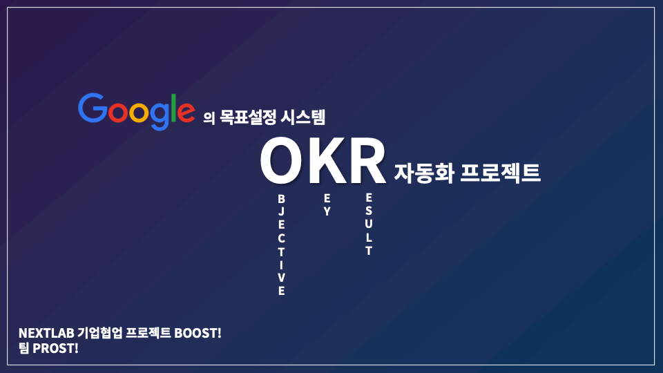
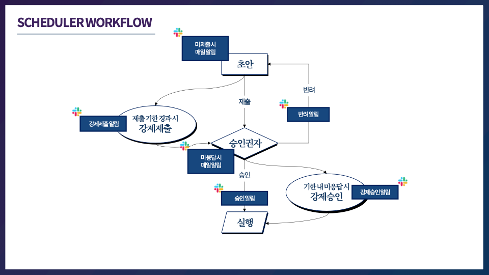
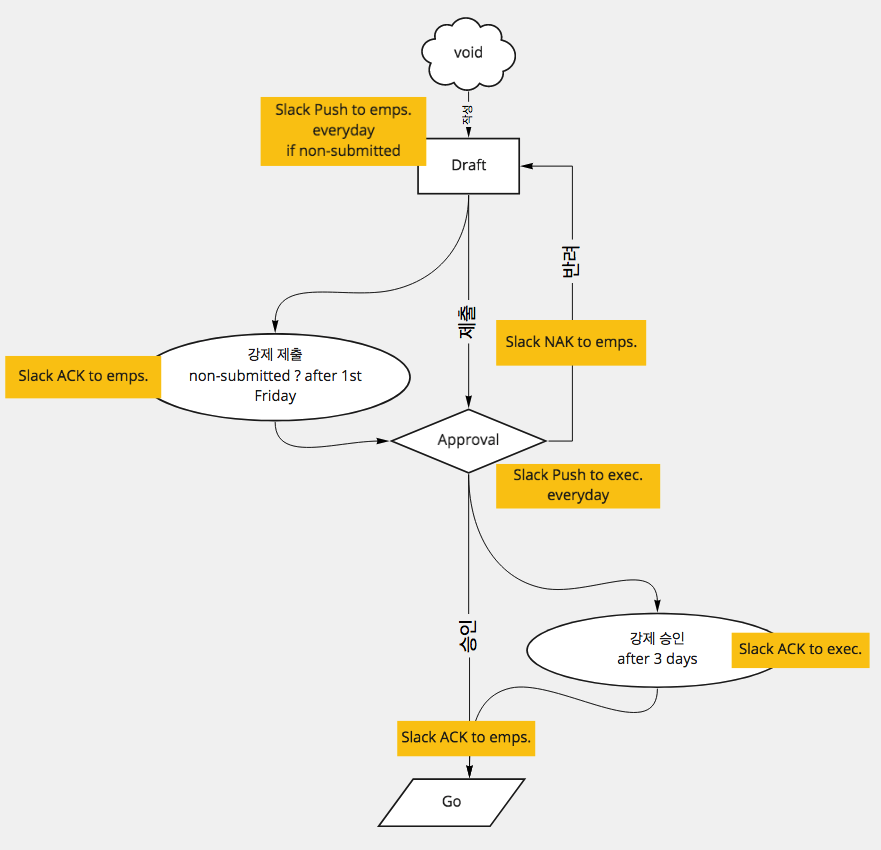

# Intro

- **팀 명 :** Prost!
- **프로젝트 명 :** Boost!
- **프로젝트 형태 :** 기업협업 프로젝트 (with NextLab)
- **팀원 :** 김홍식(팀장), 김형찬, 이규빈

# Project

# **Slack 연동 OKR 목표 관리 웹 서비스 - Boost!**

## Prost! for your OKR - Boost!

여러분의 성공적인 OKR을 위하여 건배! "Prost!"

## Overview

- Dashboard - 팀, 전사 OKR 조회
- 다음 분기 OKR 작성 - 차기 OKR 작성, 수정, 승인 요청 / OKR에 관련한 채팅 기능
- 이번 분기 OKR 조회 및 수정 - 이번 분기 OKR 달성도 조회 및 수정 / OKR에 관련한 채팅 기능
- Feedback Hub - 이번 분기 OKR에 대한 Feedback 작성 / OKR에 관련한 채팅 기능
- 팀 별 OKR 조회 - 팀, 분기별 OKR 조회

## SW Stack

### Front-End :

- Typescript React, Socket.io-Client

1. 매 분기 별 OKR 작성 및 승인
2. OKR 추가, 수정, 삭제
3. 매 분기 별 OKR에 대한 피드백 작성 가능
4. Socket.io 활용 Google Doc의 자동 저장, 자동 동기화 처럼 여러 팀원이 동시에 다른 컴퓨터에서 OKR CURD 가능
5. Socket.io 활용 각 OKR 별 메세지, 회고, Feedback 기능 구현

### Back-End :

- Python Flask (Flask-SQLAlchemy, Flask-Marshmallow)

1. Flask - 웹 서버 구현
2. Flask-SQLAlchemy - DB를 쉽게 접근할 수 있는 ORM 기술 활용을 위한 pip package
3. Flask-Marshmallow - Python Flask로 작성된 문법을 RESTFul하게, JS가 읽을 수 있게 돕는 pip package
4. Flask-Socket.io - Socket.io를 Python Flask에서 사용 가능하도록 하는 pip package
5. Database - MariaDB

- Gunicorn + Nginx

1. PM2와 같은 Python3 Process Manager

## Scheduler Workflow

- APScheduler with Slack API

1. 각 분기별 기획에 맞게 알림을 보낼 수 있도록 시간의 흐름에 따라서 APscheduler가 Slack Bot에 알림을 요청
2. Slack Bot가 각 유져에게 알림을 보내서 유져가 OKR 작성, 승인, 수정, Feedback을 잊지 않도록 도움

## 직관적인 UI

➡️ 진행도 작성은 One-Click, OKR 자체에 대해 더 고민할 수 있게 됩니다.

## 자동 저장, 동기화 기능

➡️ Socket.io 기술 적용을 통해 현재 작성중인 목표, Key Result가 적자마자 바로 DB에 동기화 됩니다.

## 반응형 웹

➡️ 언제 어디서나, 내가 어떤 Objective와 KeyResult에 집중해야 하는지 알 수 있습니다. 출장 중에도 업데이트 가능합니다.

## Slack에서 웹으로 바로 접속

➡️ Slack Bot 알림 ➡️ 웹으로 바로 접속 ➡️ 추가적인 프로그램 설치 불필요 ➡️ UX 향상

## 매 분기 해당 시기 Slack Bot 알림

➡️ 잊지 않고 OKR 작성 및 승인 가능, OKR 기능 이외의 업무 불필요

## 페이지 별 채팅(Feedback) 기능

➡️ 회의 형식이 아닌 자유롭고 효율적인 의사소통을 도움.

