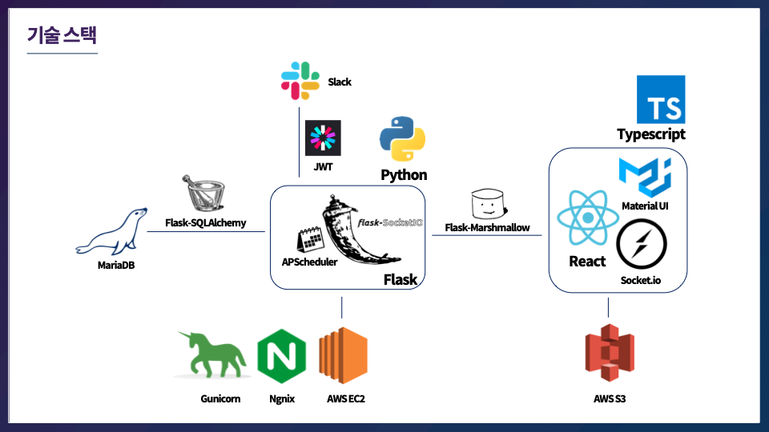
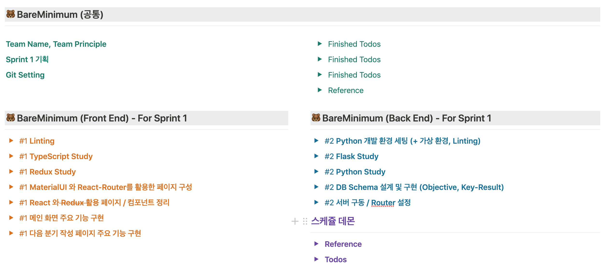
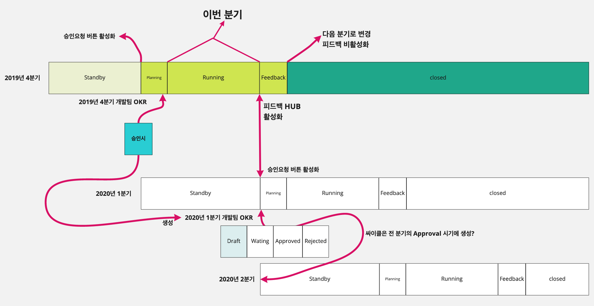
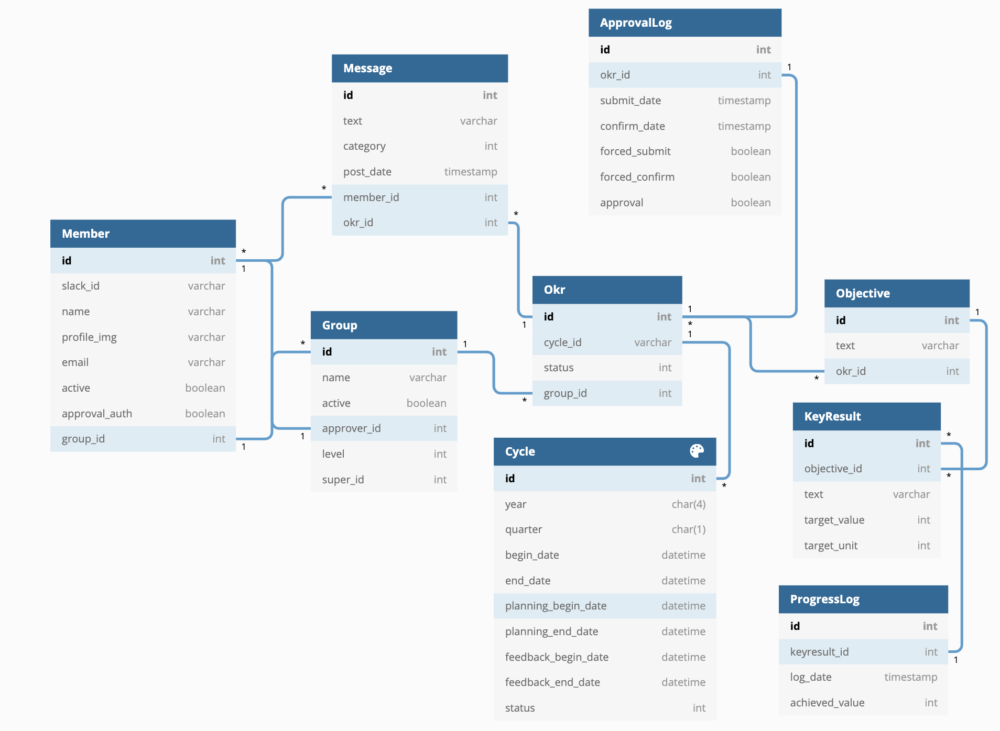
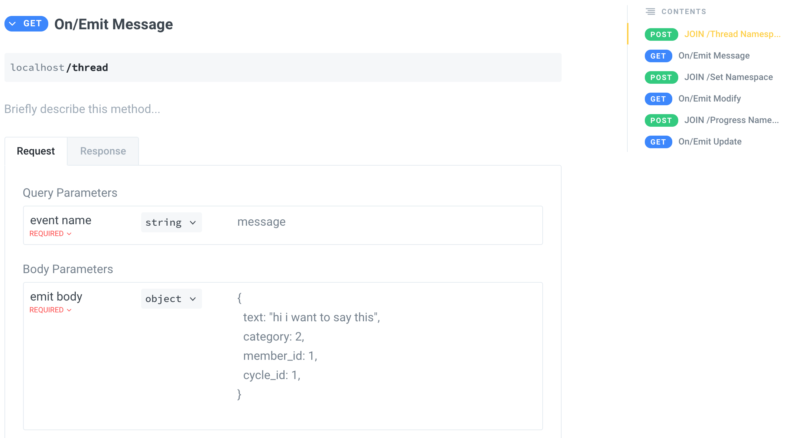

코드스테이츠 부트캠프 Immersive(심화)코스의 마지막 프로젝트는 기업협업 프로젝트로 넥스트랩과 함께 진행했다. Boost!라는 이름을 가진 이 프로젝트의 목표는

**_스타트업들이 OKR의 핵심에만 집중할 수 있는, 자동화된 피드백 기반 OKR 서비스 개발_**

이다. 규모가 작은 스타트업들이 OKR 작성과 공유, 그리고 피드백에 쓰는 리소스를 **추가적인 인력 배치 없이** 최대한 줄이고자 하는 서비스였다. 이를 슬랙을 활용하여 좀 더 효과적인 노티를 보내려 했다. 프로젝트가 요구했던 기능을 간략화하자면 다음과 같다.

1. 팀별 OKR 수립, 승인/반려 기능
2. OKR 진행률 업데이트
3. OKR 피드백
4. 전사 OKR 조회

이렇게 보았을 땐 단순한 프로젝트처럼 보일 수 있으나, 디테일하게 들어갔을 때 생각보다 구현이 쉽지 않았다. 각 팀원이 OKR을 작성할 때, 노션처럼 실시간으로 반영되는 것을 요구했고, OKR은 분기별로 반복되기에 각 기능을 특정 기간에만 활성화해야 했다.

### 스택

프론트엔드 : React(Hooks) + Typescript, CSS는 materialUI를 적용했다.

백엔드 : 서버는 Python Flask를 활용했고, 스케쥴 데몬은 APScheduler를 활용했다.



첫 프로젝트 때 프론트를 경험했기에, 부트캠프동안 최대한 많은 경험을 해보고자 **백엔드를 선택했다.**

팀은 프론트엔드 1명, 서버 백엔드 1명(나), 스케쥴 데몬 백엔드 1명으로 구성되어 각자 독립적인 영역에서 작업을 했다.

---

### 기획 및 범위설정

첫 프로젝트와 동일하게 난이도 별로 베어 미니멈(Bare Minimum), 어드밴스드(Advanced), 나이트메어(Nightmare)로 프로젝트를 기획했다. 그때와 다른 점이 있다면 지금은 주차별로 나누어 기획하며 스프린트 별로 난이도 분류를 했다.



프로젝트 시작 전에 팀원들과 함께 잡은 목표가 있었는데, 서로의 코드를 완전히 이해할 수 있게 최선을 다하자는 것이었다. 다들 낯선 스택을 활용해서 프로젝트를 진행하게 되었는데, 각자의 기능만 대략적으로 이해하고 넘어가기 보다는, 잦은 코드리뷰와 오버커뮤니케이션을 통해 서로 학습한 부분을 최대한 공유하려 했다. 그래서 프로젝트 진행간, 각자 도움을 받은 레퍼런스를 최대한 공유하려 했다.

이머시브 커리큘럼은 깃허브를 통해 진행되는데, 넥스트랩은 GitLab을 사용했다. 초반엔 적응이 쉽지 않았는데, 나중엔 branching과 PR시의 이슈 태깅이 익숙해져서 효율적으로 협업을 진행할 수 있었다.

기획 간 가장 다행이었던 점은, 넥스트랩 측에서 처음부터 디테일한 프로젝트 기획안을 제공해 준 덕분에 기획을 빠르게 정리할 수 있었다는 것이었다. 물론 그렇다고 바로 코드작업으로 넘어갈 수는 없었는데..

---

### 스키마 무한 수정

기획은 디테일했으나, 기업 측도 우리도 OKR의 Flow를 깊이 이해하고 구체화하는 것이 쉽지 않았다.

_분기 시작 전 주부터 OKR을 작성이 활성화되어 승인요청을 하고, 제때 승인요청을 하지 않으면 강제요청처리, 반려될 경우 1주일 안에 다시 요청을 해야 하고, 승인/반려를 3일안에 하지 않으면 강제 승인처리가 되고, 분기 마지막 주에는 피드백기능이 활성화 되어야 하고..._



한 분기 안의 flow가 이런 식으로 진행되고, 다른 분기 간 겹치는 기간이 있어 정확히 구분시킬 수 있어야 했다. 따라서 처음 이러한 flow를 팀원(그리고 넥스트랩 측) 모두가 동등한 수준으로 이해하기까지 수많은 디스커션을 거쳐야 했다. 이런 동기화 과정 속에서 스키마에도 무수한 변경이 있었고, 더 깔끔한 스키마를 구성하기 위해 사소한 네이밍에 대해서까지 치열하게 소통한 결과 모두가 만족하는 스키마를 만들 수 있었다. (첫 프로젝트에 비하면 스케일이 와우)



이 중 가장 어려웠던 부분은 로그에 대한 부분이었다.(ApprovalLog, ProgressLog) 각 팀의 OKR이 언제 승인/반려 되었는지에 대한 로그, OKR이 언제 얼마나 업데이트가 되었는지에 대한 로그를 모두 요구했고, 로깅에 대한 개념이 부족했던 나는 가장 효율적으로 로깅을 하기 위해 시간을 가장 많이 할애했다.

---

### 파이썬을 선택한 이유

파이썬에 대한 회고에 앞서, **내가 공부한 코드스테이츠의 모든 커리큘럼은 자바스크립트로 이루어져 있다.** 넥스트랩에서 사용하는 언어는 파이썬이었는데, 킥오프 미팅 때 백엔드를 지금껏 배워 온 NodeJS로 진행 하기를 권장했다. 하지만 두 가지 이유로 나는 파이썬에 도전하고 싶다고 강하게 주장했다.

첫째로, 4주간 빠듯하게 진행되는 이런 환경이 아니면 파이썬을 치열하게 팔 기회가 많지 않을 것이라고 생각했다. 언젠가 파이썬을 접하게 되었을 때 이 경험을 토대로 친근하게 시작할 수 있었으면 했다. 둘째로, 파이썬을 사용하는 넥스트랩 개발자 분들과 더 적극적인 피드백을 공유 받고 싶었다.

지금은 파이썬을 사용하는 기업과 협업하는 것이 아니라면 후배 수강생들에게 **절대 파이썬을 권하지 않는다**. nodeJs와 Express, Sequelize를 활용했다면 좀 더 깊어지지 않았을까, 라는 작은 미련이 남기 때문이다. 하지만 개인적으로 돌아보면 당시 환경에서는 잘 한 선택이라고 생각한다. 그 이유 중 하나로 다음의 Flask에 대한 삽질 경험이 있다.

---

### Flask 패거리와 친해지기(feat. 레퍼런스 사막)🐪

파이썬의 대표적인 웹 프레임워크 Django, Flask중 넥스트랩이 사용하는 프레임워크는 Flask였기에 망설임 없이 파이썬과 Flask를 공부하기 시작했다. 파이썬은 생각보다 더 러닝커브가 낮았다. 확실히 하이레벨 언어여서 그런지, 자바스크립트가 익숙한 입장에서 빠르게 치고 나갈 수 있었다. PIP를 활용한 프로젝트 환경설정이 다소 까다롭긴 했으나, 좋은 레퍼런스들이 많아 무리없이 진행할 수 있었다. 문제는 Flask에서 활용 가능한 Flask-SQLAlchemy를 접했을 때부터 시작되었다. 기존에 Sequelize를 활용할 때는, 다음과 같이 간단하게 JSON객체를 클라이언트에 전달할 수 있었다.

```js
models.Member.findAll().then(users => res.json(users)) //끝
```

SQLAlchemy에서도 동일하게 파이썬의 Jsonify라는 방법으로 Response에 전달하려고 했었지만, SQLAlchemy에서는 바로 json데이터로 변환할 수 없없고 **마샬링**이라는 단계를 거쳐아지만 json데이터로 전달할 수 있었다.

```py
# Flask-SQLAlchemy

members = Member.query.all()
# [ Member(1, '이름1'), Member(2, '이름2') ]
# 바로 JSON객체로 바꿀 수 없다.
return(jsonify(members))

# TypeError : Object of type Member is not JSON serializable
```

결국 Flask에서 사용할 수 있는 마샬링 방법을 찾다 Flask-Marshmallow라는 모듈을 활용해서 적용해 주었는데, 한국어 레퍼런스는 전무하고 영어 레퍼런스조차 적은 탓에 제대로 적용하기 까지 엄청난 시간을 소모해야 했다. 물론 덕분에 공식문서를 더 꼼꼼하고 치열하게 분석하는 경험을 할 수 있었다. 게다가 익숙해지니, SQLAlchemy를 활용한 쿼리과정이 너무 수월해져서 이후의 API 작성은 말 그대로 행복코딩이었다! Sequelize도 더 깊게 파봐야 알겠지만, 복잡한 스키마속에서 데이터를 쿼리해올 때 너무너무 편리했다.

---

### 회고를 통한 Socket.io 작업의 비효율성 극복

첫 번째 프로젝트에서 프론트를 맡았을 때, 채팅 구현을 위해 Socket.io를 사용했었다. 소켓과 친숙하지 않고, postman을 활용할 수도 없어서 백엔드 팀원과 문서로 대화하는 방법을 몰랐다. 결국 소켓 적용을 확인하기 위해 매번 동기적으로 작업을 진행하면서 엄청난 비효율이 발생했다. [회고링크](https://phanolog.netlify.com/IM%20TIL/17.%20%EB%B9%84%EC%A0%84%EA%B3%B5%EC%9E%90-%EA%B0%9C%EB%B0%9C%EC%9E%90-%EC%A7%80%EB%A7%9D%EC%83%9D%EC%9D%98-%EC%B2%AB-%ED%94%84%EB%A1%9C%EC%A0%9D%ED%8A%B8/)

마지막 프로젝트에서는 채팅과 비슷한 쓰레드 기능은 물론이고, 노션과 같은 실시간 반영을 구현해야 했기에 더 높은 수준으로 소켓을 활용해야 했다. 다행히 그 때의 회고 덕분에 어떡하면 더 비동기적으로 작업할 수 있을까 고민했고, Namespace와 이벤트명, 룸네임까지 규칙을 디테일하게 Gitbook으로 정리해서 프론트엔드 팀원에게 전달했다.



프론트 단에서는 소켓과 관련한 몇가지 시행착오들이 있었으나, 결과적으로 소켓 서버 부분은 수월하게 마무리 할 수 있었어서 굉장히 뿌듯했다.

---

### 프로젝트를 마치며

다른 팀보다 팀원이 부족하기도 했고, 기업이 제공한 EC2를 활용한 배포 과정에서 마지막에 고생을 좀 했지만, 결과적으로 만족스럽게 마무리할 수 있었다. 데모데이 때 활용된 PPT도 영혼을 갈아 넣어서 작성했고, 팀장은 프로젝트 소개 노션문서를 깔끔하게 만들어 주었다. [데모데이 유튜브](https://youtu.be/zjM7Z7uHwLM?t=414)

하지만 이번 프로젝트에서 얻은 가장 소중한 경험은 따로 있었다. 바로 **나와 다른 사람들과 협업하고, 커뮤니케이션하는 것**. 나는 말도 빠르고, 다소 조급한 성격을 가지고 있다. 다른 팀원 한명은 느리고 차분했다. 나머지 팀원 한명은 말로는 설명이 어렵지만 사고방식이라던지, 성향 모두 나와 매우 달랐다. 이렇게만 보면 일이 틀어지기 십상일 것 같은데, 팀원 모두 너무나도 뛰어난 소통 능력을 보여 주었다. 의견 충돌이 있을 때 묻어두고 가기보단 기분 나쁘지 않게, 솔직하게 표현했다. 잦은 디스커션이 생겼지만, 방향이 잘못되어 처음으로 돌아가야 하는 일은 발생하지 않았다. 행복한 경험이었다.

---

아직도 나는 너무 부족하다. 지금 이 글을 쓰는 시점에서 나는 CSE가 되어(나와 가장 달랐던 팀원 한명과 함께) 후배 수강생들과 라이브 세션을 진행하면서 자바스크립트의 기초에 대해 설명하고 있지만, 갈 길이 너무 멀어 보여서 이따금씩 조급해 지고는 한다.

물론 기조는 전과 같다. **내 부족한 점을 찾는 경험은 개발자로서 기분좋은 일이 아닐 수 없다.** 성공적으로 커리어 전환을 한 이후에도, 계속 부족한 점을 채우고 새로이 부족한 점을 발견하고자 한다.
